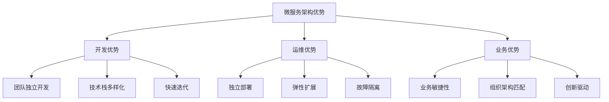

在软件架构的发展历程中，从单体架构到微服务架构的演进是一个重要的转折点。理解这一演进过程有助于我们更好地认识为什么需要服务注册与配置中心。本章将深入探讨单体架构的局限性、微服务架构的优势以及架构演进的驱动力。

## 单体架构的特点与局限

单体架构（Monolithic Architecture）是传统的软件架构模式，整个应用程序作为一个单一的单元进行开发、部署和运行。

### 单体架构的优势

```java
// 单体架构示例
@SpringBootApplication
public class MonolithicApplication {
    
    public static void main(String[] args) {
        SpringApplication.run(MonolithicApplication.class, args);
    }
    
    // 用户管理模块
    @RestController
    @RequestMapping("/users")
    public class UserController {
        // 用户相关API
    }
    
    // 订单管理模块
    @RestController
    @RequestMapping("/orders")
    public class OrderController {
        // 订单相关API
    }
    
    // 支付管理模块
    @RestController
    @RequestMapping("/payments")
    public class PaymentController {
        // 支付相关API
    }
    
    // 库存管理模块
    @RestController
    @RequestMapping("/inventory")
    public class InventoryController {
        // 库存相关API
    }
}
```

单体架构具有以下优势：
1. **开发简单**：所有功能都在一个项目中，开发工具支持好
2. **部署容易**：只需要部署一个应用包
3. **测试方便**：可以在本地进行端到端测试
4. **调试简单**：问题定位相对容易

### 单体架构的局限性

随着业务的发展，单体架构逐渐暴露出以下问题：

```yaml
# 单体架构面临的挑战
challenges:
  # 1. 开发效率问题
  development:
    - build_time: "构建时间长，影响开发效率"
    - team_coordination: "团队协作困难，代码冲突频繁"
    - technology_stack: "技术栈统一，难以引入新技术"
  
  # 2. 运维部署问题
  operations:
    - deployment_risk: "全量部署风险高"
    - scalability: "难以水平扩展"
    - fault_isolation: "故障影响范围大"
  
  # 3. 性能瓶颈问题
  performance:
    - resource_contention: "资源竞争严重"
    - bottleneck: "性能瓶颈难以定位"
    - scaling: "扩展性差"
```

## 微服务架构的兴起

微服务架构（Microservices Architecture）通过将大型应用程序拆分为一组小的、独立的服务来解决单体架构的问题。

### 微服务架构的核心特征

```java
// 微服务架构示例
// 用户服务
@SpringBootApplication
@RestController
@RequestMapping("/users")
public class UserServiceApplication {
    
    @GetMapping("/{id}")
    public User getUser(@PathVariable Long id) {
        // 用户查询逻辑
        return userService.findById(id);
    }
    
    public static void main(String[] args) {
        SpringApplication.run(UserServiceApplication.class, args);
    }
}

// 订单服务
@SpringBootApplication
@RestController
@RequestMapping("/orders")
public class OrderServiceApplication {
    
    @PostMapping
    public Order createOrder(@RequestBody CreateOrderRequest request) {
        // 订单创建逻辑
        return orderService.createOrder(request);
    }
    
    public static void main(String[] args) {
        SpringApplication.run(OrderServiceApplication.class, args);
    }
}

// 支付服务
@SpringBootApplication
@RestController
@RequestMapping("/payments")
public class PaymentServiceApplication {
    
    @PostMapping
    public Payment processPayment(@RequestBody PaymentRequest request) {
        // 支付处理逻辑
        return paymentService.processPayment(request);
    }
    
    public static void main(String[] args) {
        SpringApplication.run(PaymentServiceApplication.class, args);
    }
}
```

微服务架构具有以下核心特征：
1. **服务拆分**：按业务领域拆分为独立的服务
2. **去中心化**：每个服务可以独立开发、部署和扩展
3. **技术多样性**：不同服务可以使用不同的技术栈
4. **容错性**：单个服务故障不会影响整个系统

### 微服务架构的优势



## 架构演进的驱动力

从单体架构向微服务架构的演进是由多种因素驱动的：

### 业务驱动因素

```java
// 业务复杂度增长示例
public class BusinessComplexityDriver {
    
    // 1. 业务功能增加
    public void handleBusinessGrowth() {
        // 初期功能
        // - 用户注册登录
        // - 商品浏览
        // - 简单下单
        
        // 发展期功能
        // - 会员体系
        // - 营销活动
        // - 数据分析
        // - 第三方集成
        // - 多端支持
    }
    
    // 2. 用户规模扩大
    public void handleUserScaleGrowth() {
        // 用户量从万级到百万级
        // 并发访问量大幅提升
        // 对系统性能和稳定性要求更高
    }
    
    // 3. 市场竞争加剧
    public void handleMarketCompetition() {
        // 需要快速响应市场需求
        // 频繁的功能迭代
        // A/B测试需求
        // 个性化推荐
    }
}
```

### 技术驱动因素

```yaml
# 技术发展推动架构演进
technical_drivers:
  # 1. 云计算普及
  cloud_computing:
    - infrastructure_as_a_service: "基础设施即服务降低部署门槛"
    - container_technology: "容器技术简化服务部署"
    - orchestration_platforms: "编排平台支持服务管理"
  
  # 2. DevOps文化
  devops:
    - continuous_integration: "持续集成提高交付效率"
    - continuous_deployment: "持续部署加速价值交付"
    - automated_testing: "自动化测试保障质量"
  
  # 3. 分布式系统成熟
  distributed_systems:
    - service_discovery: "服务发现技术成熟"
    - configuration_management: "配置管理工具完善"
    - distributed_tracing: "分布式追踪技术发展"
```

### 组织驱动因素

```java
// 组织架构影响技术架构
public class OrganizationStructureDriver {
    
    // 康威定律：设计系统的架构受制于产生这些设计的组织的沟通结构
    public void applyConwayLaw() {
        // 组织结构决定系统架构
        // 大团队 -> 单体应用
        // 小团队 -> 微服务
        
        // 组织结构变化推动架构演进
        // 从职能团队到产品团队
        // 从集中式到分布式
    }
    
    // 团队规模扩大
    public void handleTeamGrowth() {
        // 小团队(5-10人) -> 单体架构
        // 大团队(50+人) -> 微服务架构
        
        // 团队自治需求
        // 独立开发、测试、部署
        // 技术选型自主权
    }
}
```

## 微服务架构面临的挑战

虽然微服务架构解决了单体架构的许多问题，但也引入了新的挑战：

### 分布式系统复杂性

```java
// 分布式系统挑战示例
public class DistributedSystemChallenges {
    
    // 1. 服务间通信
    public void handleServiceCommunication() {
        // 网络延迟
        // 网络分区
        // 服务不可用
        // 超时处理
        // 重试机制
    }
    
    // 2. 数据一致性
    public void handleDataConsistency() {
        // 分布式事务
        // 最终一致性
        // 数据同步
        // 冲突解决
    }
    
    // 3. 系统可观测性
    public void handleObservability() {
        // 分布式追踪
        // 统一日志
        // 指标监控
        // 告警机制
    }
}
```

### 运维复杂性

```yaml
# 微服务运维复杂性
operational_complexity:
  # 1. 服务治理
  service_governance:
    - service_discovery: "服务发现与注册"
    - load_balancing: "负载均衡"
    - circuit_breaker: "熔断机制"
    - rate_limiting: "限流控制"
  
  # 2. 配置管理
  configuration_management:
    - centralized_config: "集中配置管理"
    - dynamic_config: "动态配置更新"
    - environment_isolation: "环境隔离"
    - config_versioning: "配置版本管理"
  
  # 3. 部署运维
  deployment_operations:
    - blue_green_deployment: "蓝绿部署"
    - canary_release: "金丝雀发布"
    - rolling_update: "滚动更新"
    - health_check: "健康检查"
```

## 为什么需要服务注册与配置中心

微服务架构的这些挑战正是服务注册与配置中心要解决的核心问题：

### 服务注册中心解决的问题

```java
// 服务注册中心解决的问题
public class ServiceRegistrySolutions {
    
    // 1. 服务发现
    public void solveServiceDiscovery() {
        // 传统方式：硬编码IP端口
        String userServiceUrl = "http://192.168.1.100:8080";
        
        // 微服务方式：服务注册中心
        ServiceInstance userService = serviceRegistry.discover("user-service");
        String userServiceUrl = "http://" + userService.getHost() + ":" + userService.getPort();
    }
    
    // 2. 负载均衡
    public void solveLoadBalancing() {
        List<ServiceInstance> userServices = serviceRegistry.discoverAll("user-service");
        ServiceInstance selectedService = loadBalancer.choose(userServices);
    }
    
    // 3. 健康检查
    public void solveHealthCheck() {
        // 服务自动注册与注销
        // 心跳检测机制
        // 故障自动隔离
    }
}
```

### 配置中心解决的问题

```java
// 配置中心解决的问题
public class ConfigCenterSolutions {
    
    // 1. 配置集中管理
    public void solveCentralizedConfig() {
        // 传统方式：本地配置文件
        Properties props = new Properties();
        props.load(new FileInputStream("config.properties"));
        
        // 微服务方式：配置中心
        Config config = configCenter.getConfig("user-service", "prod");
        String dbUrl = config.getProperty("database.url");
    }
    
    // 2. 动态配置更新
    public void solveDynamicConfig() {
        // 配置变更实时推送
        // 应用无需重启即可生效
        // 灰度发布配置
    }
    
    // 3. 环境隔离
    public void solveEnvironmentIsolation() {
        // 不同环境使用不同配置
        Config devConfig = configCenter.getConfig("user-service", "dev");
        Config prodConfig = configCenter.getConfig("user-service", "prod");
    }
}
```

## 架构演进的最佳实践

在进行架构演进时，需要遵循一些最佳实践：

### 渐进式演进

```java
// 渐进式架构演进示例
public class ProgressiveEvolution {
    
    // 1. 模块化单体
    public void modularizeMonolith() {
        // 将单体应用按业务领域拆分为模块
        // 建立清晰的模块边界
        // 定义模块间接口
    }
    
    // 2. 提取核心服务
    public void extractCoreServices() {
        // 识别核心业务功能
        // 将核心功能独立为服务
        // 建立服务间通信机制
    }
    
    // 3. 逐步拆分
    public void gradualDecomposition() {
        // 按业务优先级逐步拆分
        // 先拆分变化频率高的模块
        // 保持数据一致性
    }
}
```

### 技术选型考虑

```yaml
# 微服务技术选型考虑因素
technology_selection:
  # 1. 服务框架
  service_framework:
    - spring_cloud: "Spring Cloud生态完善"
    - dubbo: "阿里巴巴开源，国内流行"
    - grpc: "Google开发，性能优秀"
    - kubernetes: "容器编排，服务治理"
  
  # 2. 服务注册中心
  service_registry:
    - eureka: "Netflix开源，Spring Cloud集成"
    - consul: "HashiCorp开发，功能丰富"
    - nacos: "阿里巴巴开源，注册配置一体化"
    - zookeeper: "Apache项目，强一致性"
  
  # 3. 配置中心
  config_center:
    - apollo: "携程开源，功能完善"
    - nacos: "阿里巴巴开源，注册配置一体化"
    - spring_cloud_config: "Spring Cloud原生支持"
    - consul: "内置KV存储"
```

## 总结

从单体架构到微服务架构的演进是软件架构发展的必然趋势，它解决了单体架构在开发效率、运维部署、性能扩展等方面的局限性。然而，微服务架构也带来了分布式系统的复杂性挑战，这正是服务注册与配置中心要解决的核心问题。

通过服务注册中心，我们可以实现服务的自动发现、负载均衡和健康检查；通过配置中心，我们可以实现配置的集中管理、动态更新和环境隔离。这些基础设施组件为微服务架构的成功实施提供了重要保障。

理解这一演进过程有助于我们更好地认识服务注册与配置中心的价值，并在实际项目中做出合适的技术选型和架构决策。