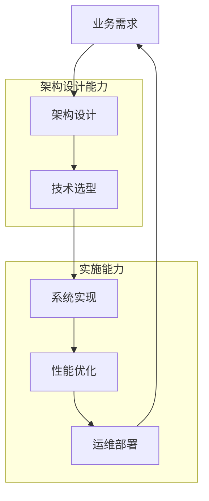

经过前面章节的深入探讨，我们全面了解了服务注册与配置中心从基础概念到高级特性的完整知识体系。本章将对全书内容进行总结，并为读者提供一条清晰的学习路径，帮助大家从初学者成长为架构师。

## 从入门到精通的进阶路线

学习服务注册与配置中心需要循序渐进，按照以下路线逐步深入：

### 第一阶段：基础概念掌握

**目标**：理解服务注册与配置中心的基本概念和工作原理

**学习内容**：
1. 微服务架构演进历程
2. 服务注册中心的基本原理（服务注册、发现、心跳机制）
3. 配置中心的基本原理（配置存储、推送、热更新）
4. CAP理论在注册与配置中心中的应用

**实践项目**：
```bash
# 1. 搭建简单的服务注册中心
# 使用Spring Cloud Eureka搭建注册中心
docker run -p 8761:8761 springcloud/eureka-server

# 2. 创建服务提供者和消费者
# 服务提供者注册到Eureka
@SpringBootApplication
@EnableEurekaClient
public class ServiceProviderApplication {
    public static void main(String[] args) {
        SpringApplication.run(ServiceProviderApplication.class, args);
    }
}

# 服务消费者发现服务
@RestController
public class ServiceConsumerController {
    @Autowired
    private DiscoveryClient discoveryClient;
    
    @GetMapping("/consume")
    public String consume() {
        List<ServiceInstance> instances = discoveryClient.getInstances("service-provider");
        // 调用服务实例
    }
}
```

### 第二阶段：实战技能培养

**目标**：掌握注册与配置中心的实现原理和使用技巧

**学习内容**：
1. 手写最小可用注册中心
2. 实现配置中心雏形
3. 数据持久化与高可用设计
4. 主流框架深度解析（ZooKeeper、Eureka、Consul、Nacos、Apollo）

**实践项目**：
```java
// 1. 实现简单的内存注册中心
public class SimpleRegistry {
    private ConcurrentHashMap<String, List<ServiceInstance>> registry = new ConcurrentHashMap<>();
    
    public void register(String serviceName, ServiceInstance instance) {
        registry.computeIfAbsent(serviceName, k -> new ArrayList<>()).add(instance);
    }
    
    public List<ServiceInstance> discover(String serviceName) {
        return registry.getOrDefault(serviceName, new ArrayList<>());
    }
}

// 2. 实现配置推送机制
public class ConfigPusher {
    private Map<String, List<ConfigListener>> listeners = new ConcurrentHashMap<>();
    
    public void pushConfig(String configKey, String configValue) {
        List<ConfigListener> configListeners = listeners.get(configKey);
        if (configListeners != null) {
            for (ConfigListener listener : configListeners) {
                listener.onConfigChanged(configKey, configValue);
            }
        }
    }
}
```

### 第三阶段：高级特性掌握

**目标**：深入理解注册与配置中心的高级特性和优化技巧

**学习内容**：
1. 服务发现模式（客户端发现、服务端发现、DNS、Service Mesh）
2. 配置中心高级特性（加密、灰度发布、多环境隔离）
3. 一致性与高可用实现（Raft、Paxos、Leader选举）
4. 性能与扩展性优化（长连接、分片存储、多集群部署）

**实践项目**：
```java
// 1. 实现Raft算法的简化版本
public class SimpleRaftNode {
    private RaftState state = RaftState.FOLLOWER;
    private long currentTerm = 0;
    private String votedFor = null;
    
    public void handleElectionTimeout() {
        if (state == RaftState.FOLLOWER) {
            startElection();
        }
    }
    
    private void startElection() {
        state = RaftState.CANDIDATE;
        currentTerm++;
        votedFor = nodeId;
        // 发送投票请求
    }
}

// 2. 实现配置灰度发布
public class GrayReleaseManager {
    private Set<String> grayInstances = new HashSet<>();
    private double grayRatio = 0.1;
    
    public boolean shouldUseGrayConfig(String instanceId) {
        if (grayInstances.contains(instanceId)) {
            return true;
        }
        return Math.random() < grayRatio;
    }
}
```

### 第四阶段：企业级应用

**目标**：掌握在企业环境中使用注册与配置中心的最佳实践

**学习内容**：
1. 电商系统中的应用实践
2. 企业级最佳实践（选型、集成、运维）
3. 监控与运维体系建设
4. 安全与合规要求

**实践项目**：
```yaml
# 1. 企业级配置管理
# 多环境配置隔离
spring:
  profiles:
    active: @spring.profiles.active@
    
---
spring:
  profiles: dev
  cloud:
    nacos:
      config:
        server-addr: dev-nacos:8848
        namespace: dev-namespace

---
spring:
  profiles: prod
  cloud:
    nacos:
      config:
        server-addr: prod-nacos:8848
        namespace: prod-namespace

# 2. 监控告警配置
management:
  endpoints:
    web:
      exposure:
        include: "*"
  endpoint:
    health:
      show-details: always
      
# Prometheus监控指标
metrics:
  export:
    prometheus:
      enabled: true
      step: 1m
```

### 第五阶段：前沿技术探索

**目标**：了解和掌握云原生时代的最新技术趋势

**学习内容**：
1. Service Mesh与注册中心的关系
2. 配置即代码（Configuration as Code）
3. 云原生架构下的服务治理
4. 未来发展趋势预测

**实践项目**：
```yaml
# 1. Istio服务网格配置
apiVersion: networking.istio.io/v1alpha3
kind: VirtualService
metadata:
  name: product-service
spec:
  hosts:
  - product-service
  http:
  - route:
    - destination:
        host: product-service
        subset: v1
      weight: 90
    - destination:
        host: product-service
        subset: v2
      weight: 10

# 2. GitOps配置管理
apiVersion: argoproj.io/v1alpha1
kind: Application
metadata:
  name: guestbook
spec:
  project: default
  source:
    repoURL: https://github.com/argoproj/argocd-example-apps.git
    targetRevision: HEAD
    path: guestbook
  destination:
    server: https://kubernetes.default.svc
    namespace: guestbook
```

## 学习 RPC、配置、服务网格的整体视角

服务注册与配置中心是微服务架构的重要组成部分，需要与RPC框架、服务网格等技术协同工作。

### 技术栈全景图

```
┌─────────────────────────────────────────────────────────────┐
│                    应用层 (Application Layer)               │
├─────────────────────────────────────────────────────────────┤
│  RPC框架 (gRPC, Dubbo, Spring Cloud OpenFeign)             │
├─────────────────────────────────────────────────────────────┤
│  服务治理 (熔断、限流、降级、监控)                          │
├─────────────────────────────────────────────────────────────┤
│  服务网格 (Istio, Linkerd)                                 │
├─────────────────────────────────────────────────────────────┤
│  注册中心 (Eureka, Nacos, Consul)                          │
│  配置中心 (Apollo, Nacos, Spring Cloud Config)             │
├─────────────────────────────────────────────────────────────┤
│                    基础设施层 (Infrastructure Layer)        │
└─────────────────────────────────────────────────────────────┘
```

### 学习路径建议

#### 1. RPC框架学习

```java
// 1. gRPC服务定义
syntax = "proto3";

service UserService {
    rpc GetUser(GetUserRequest) returns (GetUserResponse);
    rpc CreateUser(CreateUserRequest) returns (CreateUserResponse);
}

message GetUserRequest {
    int64 user_id = 1;
}

message GetUserResponse {
    int64 user_id = 1;
    string username = 2;
    string email = 3;
}

// 2. Dubbo服务接口
public interface UserService {
    User getUser(Long userId);
    User createUser(CreateUserRequest request);
}

@Service
public class UserServiceImpl implements UserService {
    @Override
    public User getUser(Long userId) {
        // 实现逻辑
    }
}
```

#### 2. 服务网格学习

```yaml
# 1. Istio安装
curl -L https://istio.io/downloadIstio | sh -
cd istio-*
export PATH=$PWD/bin:$PATH
istioctl install --set profile=demo -y

# 2. 注入Sidecar
kubectl apply -f <(istioctl kube-inject -f samples/bookinfo/platform/kube/bookinfo.yaml)

# 3. 配置流量管理
apiVersion: networking.istio.io/v1alpha3
kind: Gateway
metadata:
  name: bookinfo-gateway
spec:
  selector:
    istio: ingressgateway
  servers:
  - port:
      number: 80
      name: http
      protocol: HTTP
    hosts:
    - "*"
```

#### 3. 云原生技术学习

```bash
# 1. Kubernetes基础操作
kubectl get pods
kubectl get services
kubectl describe pod <pod-name>
kubectl logs <pod-name>

# 2. Helm包管理
helm repo add bitnami https://charts.bitnami.com/bitnami
helm install my-release bitnami/nginx

# 3. Prometheus监控
kubectl port-forward svc/prometheus-server 9090:80
# 访问 http://localhost:9090
```

## 从工程师到架构师的思维转变

成为架构师不仅需要技术深度，更需要系统性思维和战略眼光。

### 思维方式转变

#### 1. 从实现到设计

**工程师思维**：
```java
// 关注如何实现功能
public class UserService {
    public User getUser(Long userId) {
        // 直接实现查询逻辑
        return userRepository.findById(userId);
    }
}
```

**架构师思维**：
```java
// 关注系统设计和权衡
public class UserServiceArchitecture {
    // 考虑的因素：
    // 1. 性能要求：QPS、延迟
    // 2. 可用性要求：99.9% vs 99.99%
    // 3. 数据一致性：强一致 vs 最终一致
    // 4. 扩展性：水平扩展 vs 垂直扩展
    // 5. 运维复杂度：部署、监控、故障恢复
    
    public User getUser(Long userId) {
        // 根据业务场景选择合适的实现方案
        if (isHighPerformanceRequired()) {
            return getUserFromCache(userId);
        } else {
            return getUserFromDatabase(userId);
        }
    }
}
```

#### 2. 从局部到全局

**局部优化思维**：
```yaml
# 只关注单个服务的配置
user-service:
  database:
    url: jdbc:mysql://localhost:3306/user_db
    pool-size: 10
```

**全局架构思维**：
```yaml
# 考虑整个系统的配置管理
# 配置中心设计
config-center:
  # 多环境支持
  environments:
    - dev
    - test
    - staging
    - prod
  
  # 多集群支持
  clusters:
    - region: cn-north
      datacenter: beijing
    - region: cn-south
      datacenter: shanghai
  
  # 配置版本管理
  version-control:
    enabled: true
    retention: 30d
  
  # 安全管控
  security:
    encryption:
      enabled: true
      algorithm: AES-256
    access-control:
      enabled: true
```

#### 3. 从技术到业务

**技术导向**：
```java
// 关注技术实现细节
public class OrderService {
    @Autowired
    private OrderRepository orderRepository;
    
    @Autowired
    private PaymentService paymentService;
    
    @Autowired
    private InventoryService inventoryService;
    
    public Order createOrder(CreateOrderRequest request) {
        // 技术实现逻辑
    }
}
```

**业务导向**：
```java
// 关注业务价值和用户体验
public class OrderServiceArchitecture {
    // 业务目标：
    // 1. 订单创建成功率：>99.9%
    // 2. 订单创建平均耗时：<200ms
    // 3. 系统可用性：99.99%
    // 4. 数据一致性：订单、支付、库存保持一致
    
    // 架构设计考虑：
    // 1. 如何保证订单创建的原子性？
    // 2. 如何处理支付失败的情况？
    // 3. 如何保证库存扣减的准确性？
    // 4. 如何实现系统的高可用和容错？
    
    public Order createOrder(CreateOrderRequest request) {
        // 基于业务需求的架构设计
    }
}
```

### 架构师核心能力

#### 1. 系统设计能力



#### 2. 技术广度与深度

**技术广度**：
- 了解主流技术栈的特点和适用场景
- 掌握多种架构模式的优缺点
- 熟悉云原生技术生态

**技术深度**：
- 深入理解核心技术原理
- 具备性能调优和故障排查能力
- 能够进行技术创新和优化

#### 3. 沟通协调能力

```java
// 架构师沟通要点
public class ArchitectureCommunication {
    
    // 与产品经理沟通
    public void communicateWithProductManager() {
        // 1. 理解业务需求和用户痛点
        // 2. 评估技术可行性
        // 3. 提供技术方案建议
        // 4. 说明技术风险和约束
    }
    
    // 与开发团队沟通
    public void communicateWithDevelopmentTeam() {
        // 1. 清晰传达架构设计意图
        // 2. 提供技术指导和支持
        // 3. 解答技术疑问
        // 4. 审查代码质量
    }
    
    // 与运维团队沟通
    public void communicateWithOperationsTeam() {
        // 1. 说明系统部署要求
        // 2. 提供监控和告警方案
        // 3. 制定故障恢复计划
        // 4. 协助性能调优
    }
}
```

## 总结

服务注册与配置中心作为微服务架构的核心组件，其重要性不言而喻。通过本书的学习，我们希望读者能够：

1. **掌握基础知识**：理解服务注册与配置中心的基本原理和工作机制
2. **具备实战能力**：能够独立设计和实现注册与配置中心解决方案
3. **深入高级特性**：掌握高可用、高性能、安全等高级特性的实现方法
4. **应用企业实践**：了解企业级应用中的最佳实践和经验教训
5. **洞察技术趋势**：把握云原生时代的技术发展方向

学习是一个持续的过程，技术也在不断演进。希望本书能够为读者提供坚实的基础和清晰的路径，在服务注册与配置中心的学习和实践中不断进步，最终成长为优秀的架构师。

记住，成为一名优秀的架构师不仅需要深厚的技术功底，更需要广阔的视野、系统性思维和持续学习的能力。愿每一位读者都能在这条道路上越走越远，为构建更加优秀的软件系统贡献自己的力量。