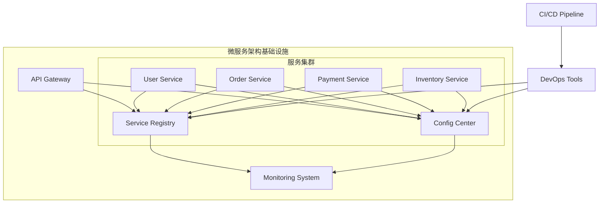

在软件架构的发展历程中，从单体架构到微服务架构的演进是一个重要的转折点。这一演进不仅改变了我们构建和部署应用程序的方式，也催生了服务注册与配置中心等基础设施组件的诞生。本章将深入探讨这一演进过程，帮助读者理解为什么我们需要服务注册与配置中心。

## 单体架构的特点与局限

单体架构是传统的软件架构模式，它将所有功能模块打包在一个应用程序中进行部署和运行。

### 单体架构的优势

```java
// 典型的单体架构应用结构
// my-app/
// ├── src/
// │   ├── main/
// │   │   ├── java/
// │   │   │   └── com/example/myapp/
// │   │   │       ├── user/          // 用户管理模块
// │   │   │       ├── order/         // 订单管理模块
// │   │   │       ├── payment/       // 支付管理模块
// │   │   │       ├── inventory/     // 库存管理模块
// │   │   │       └── MyAppApplication.java
// │   │   └── resources/
// │   └── test/
// ├── pom.xml
// └── Dockerfile

// 单体架构应用启动类
@SpringBootApplication
public class MyAppApplication {
    public static void main(String[] args) {
        SpringApplication.run(MyAppApplication.class, args);
    }
}

// 用户服务模块
@RestController
@RequestMapping("/users")
public class UserController {
    @Autowired
    private UserService userService;
    
    @GetMapping("/{id}")
    public User getUser(@PathVariable Long id) {
        return userService.findById(id);
    }
}

// 订单服务模块
@RestController
@RequestMapping("/orders")
public class OrderController {
    @Autowired
    private OrderService orderService;
    
    @PostMapping
    public Order createOrder(@RequestBody CreateOrderRequest request) {
        return orderService.createOrder(request);
    }
}
```

单体架构具有以下优势：
1. **开发简单**：所有代码在一个项目中，易于开发和调试
2. **部署方便**：只需要部署一个应用包
3. **测试容易**：可以在同一进程中进行端到端测试
4. **性能较好**：模块间调用通过方法调用，无需网络开销

### 单体架构的局限性

随着业务的发展，单体架构逐渐暴露出以下问题：

```java
// 单体架构的扩展性问题示例
@Service
public class OrderService {
    
    @Autowired
    private UserService userService;      // 用户服务依赖
    
    @Autowired
    private InventoryService inventoryService;  // 库存服务依赖
    
    @Autowired
    private PaymentService paymentService;      // 支付服务依赖
    
    // 创建订单的复杂流程
    public Order createOrder(CreateOrderRequest request) {
        // 1. 验证用户信息
        User user = userService.findById(request.getUserId());
        if (user == null) {
            throw new UserNotFoundException("用户不存在");
        }
        
        // 2. 检查库存
        for (OrderItem item : request.getItems()) {
            if (!inventoryService.checkStock(item.getProductId(), item.getQuantity())) {
                throw new InsufficientStockException("库存不足");
            }
        }
        
        // 3. 创建订单
        Order order = new Order();
        order.setUserId(request.getUserId());
        order.setItems(request.getItems());
        order.setStatus(OrderStatus.CREATED);
        order = orderRepository.save(order);
        
        // 4. 扣减库存
        for (OrderItem item : request.getItems()) {
            inventoryService.decreaseStock(item.getProductId(), item.getQuantity());
        }
        
        // 5. 处理支付
        Payment payment = paymentService.processPayment(order.getId(), order.getTotalAmount());
        order.setPaymentId(payment.getId());
        order.setStatus(OrderStatus.PAID);
        order = orderRepository.save(order);
        
        return order;
    }
}
```

单体架构的主要局限性包括：
1. **扩展性差**：无法针对特定模块进行独立扩展
2. **技术栈锁定**：整个应用必须使用相同的技术栈
3. **部署风险高**：任何小改动都需要全量部署
4. **团队协作困难**：大型团队在同一个代码库上协作困难
5. **故障影响面大**：一个模块的问题可能影响整个系统

## 微服务架构的兴起

为了解决单体架构的局限性，微服务架构应运而生。

### 微服务架构的核心理念

```yaml
# 微服务架构示例
# 微服务拆分方案
microservices:
  user-service:
    description: 用户管理服务
    technologies: 
      - Spring Boot
      - MySQL
      - Redis
    endpoints:
      - GET /users/{id}
      - POST /users
      - PUT /users/{id}
  
  order-service:
    description: 订单管理服务
    technologies:
      - Spring Boot
      - MySQL
      - RabbitMQ
    endpoints:
      - GET /orders/{id}
      - POST /orders
      - PUT /orders/{id}
  
  payment-service:
    description: 支付服务
    technologies:
      - Spring Boot
      - PostgreSQL
      - Kafka
    endpoints:
      - POST /payments
      - GET /payments/{id}
  
  inventory-service:
    description: 库存服务
    technologies:
      - Spring Boot
      - MongoDB
      - Redis
    endpoints:
      - GET /inventory/{productId}
      - POST /inventory/{productId}/decrease
```

微服务架构具有以下特点：
1. **服务拆分**：按业务领域将应用拆分为多个独立的服务
2. **去中心化**：每个服务可以独立开发、部署和扩展
3. **技术多样性**：不同服务可以使用不同的技术栈
4. **容错性**：单个服务的故障不会影响整个系统

### 微服务架构的挑战

```java
// 微服务间通信示例
@RestController
public class OrderController {
    
    @Autowired
    private UserServiceClient userServiceClient;
    
    @Autowired
    private InventoryServiceClient inventoryServiceClient;
    
    @Autowired
    private PaymentServiceClient paymentServiceClient;
    
    @PostMapping
    public ResponseEntity<Order> createOrder(@RequestBody CreateOrderRequest request) {
        try {
            // 1. 验证用户信息 - 调用用户服务
            User user = userServiceClient.getUser(request.getUserId());
            if (user == null) {
                return ResponseEntity.badRequest().build();
            }
            
            // 2. 检查库存 - 调用库存服务
            for (OrderItem item : request.getItems()) {
                Inventory inventory = inventoryServiceClient.getInventory(item.getProductId());
                if (inventory.getQuantity() < item.getQuantity()) {
                    return ResponseEntity.badRequest().build();
                }
            }
            
            // 3. 创建订单
            Order order = orderService.createOrder(request);
            
            // 4. 扣减库存 - 调用库存服务
            for (OrderItem item : request.getItems()) {
                inventoryServiceClient.decreaseStock(item.getProductId(), item.getQuantity());
            }
            
            // 5. 处理支付 - 调用支付服务
            Payment payment = paymentServiceClient.processPayment(order.getId(), order.getTotalAmount());
            order.setPaymentId(payment.getId());
            order.setStatus(OrderStatus.PAID);
            order = orderService.updateOrder(order);
            
            return ResponseEntity.ok(order);
        } catch (Exception e) {
            // 处理服务调用异常
            return ResponseEntity.status(HttpStatus.SERVICE_UNAVAILABLE).build();
        }
    }
}
```

微服务架构带来的新挑战：
1. **服务发现**：如何找到需要调用的服务实例
2. **配置管理**：如何管理多个服务的配置
3. **网络通信**：服务间通信的可靠性和性能
4. **数据一致性**：分布式事务的处理
5. **监控运维**：如何监控和运维大量服务

## 服务注册与配置中心的必要性

微服务架构的挑战催生了服务注册与配置中心的诞生。

### 服务注册中心的必要性

```java
// 服务注册中心解决的问题
public class ServiceRegistryProblem {
    
    // 问题1: IP/端口硬编码
    // 不好的做法
    public class BadOrderService {
        private static final String USER_SERVICE_URL = "http://192.168.1.100:8080";
        private static final String INVENTORY_SERVICE_URL = "http://192.168.1.101:8081";
        private static final String PAYMENT_SERVICE_URL = "http://192.168.1.102:8082";
        
        public User getUser(Long userId) {
            // 直接调用固定IP和端口
            return restTemplate.getForObject(USER_SERVICE_URL + "/users/" + userId, User.class);
        }
    }
    
    // 问题2: 手工维护服务列表
    // 不好的做法
    public class ManualServiceManagement {
        private List<ServiceInstance> userServiceInstances = Arrays.asList(
            new ServiceInstance("192.168.1.100", 8080),
            new ServiceInstance("192.168.1.103", 8080),
            new ServiceInstance("192.168.1.104", 8080)
        );
        
        public ServiceInstance selectUserServiceInstance() {
            // 简单的轮询负载均衡
            return userServiceInstances.get(new Random().nextInt(userServiceInstances.size()));
        }
    }
}
```

服务注册中心解决的问题：
1. **动态服务发现**：自动发现和管理服务实例
2. **负载均衡**：提供智能的负载均衡策略
3. **健康检查**：自动检测和移除不健康的服务实例
4. **服务治理**：提供服务路由、限流、熔断等功能

### 配置中心的必要性

```java
// 配置中心解决的问题
public class ConfigCenterProblem {
    
    // 问题1: 配置文件分散
    // 不好的做法
    public class ScatteredConfig {
        // 用户服务配置文件: user-service.properties
        // database.url=jdbc:mysql://localhost:3306/user_db
        // redis.host=localhost
        // redis.port=6379
        
        // 订单服务配置文件: order-service.properties
        // database.url=jdbc:mysql://localhost:3306/order_db
        // mq.broker=localhost:9092
        
        // 支付服务配置文件: payment-service.properties
        // database.url=jdbc:postgresql://localhost:5432/payment_db
        // third.party.api.key=secret_key
    }
    
    // 问题2: 配置更新困难
    // 不好的做法
    public class DifficultConfigUpdate {
        @Value("${database.url}")
        private String databaseUrl;
        
        @Value("${redis.host}")
        private String redisHost;
        
        // 当配置变更时，需要重启所有服务
        public void updateConfig() {
            // 无法动态更新配置
            // 只能重启服务才能生效
        }
    }
}
```

配置中心解决的问题：
1. **集中管理**：统一管理所有服务的配置
2. **动态更新**：支持配置的动态更新，无需重启服务
3. **环境隔离**：支持不同环境的配置隔离
4. **版本控制**：提供配置的版本管理和回滚功能

## 微服务架构基础设施

服务注册与配置中心是微服务架构的核心基础设施。

### 基础设施架构图



### 基础设施组件职责

```java
// 基础设施组件职责示例
public class InfrastructureComponents {
    
    // 服务注册中心职责
    public class ServiceRegistryResponsibilities {
        /*
         * 1. 服务注册
         * 2. 服务发现
         * 3. 健康检查
         * 4. 负载均衡
         * 5. 服务路由
         * 6. 元数据管理
         */
    }
    
    // 配置中心职责
    public class ConfigCenterResponsibilities {
        /*
         * 1. 配置存储
         * 2. 配置分发
         * 3. 配置更新
         * 4. 环境管理
         * 5. 版本控制
         * 6. 安全管控
         */
    }
    
    // 监控系统职责
    public class MonitoringResponsibilities {
        /*
         * 1. 指标收集
         * 2. 日志收集
         * 3. 告警通知
         * 4. 可视化展示
         * 5. 性能分析
         * 6. 故障诊断
         */
    }
}
```

## 总结

从单体架构到微服务架构的演进是软件开发领域的重要变革。这一演进带来了更高的灵活性、可扩展性和容错性，但同时也引入了新的挑战，如服务发现和配置管理等。服务注册与配置中心作为微服务架构的核心基础设施，有效解决了这些挑战，为构建现代化的分布式系统提供了重要支撑。

理解这一演进过程有助于我们更好地认识服务注册与配置中心的价值和必要性，为后续深入学习这些技术奠定基础。