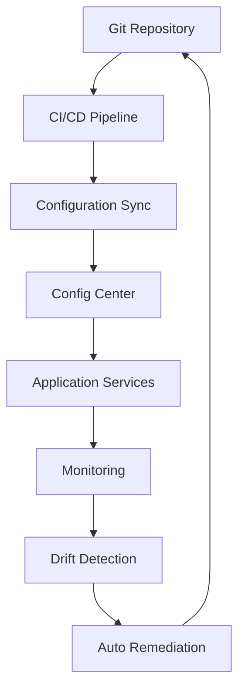

在现代软件开发和运维实践中，"配置即代码"（Configuration as Code，简称CaC）已经成为一种重要的方法论。它将配置管理提升到了与应用程序代码同等重要的地位，通过版本控制、自动化和声明式管理来提高系统的可靠性、可重复性和可维护性。本章将深入探讨GitOps与配置中心的结合，以及声明式配置管理等前沿实践。

## GitOps 与配置中心结合

GitOps是一种运维框架，它将Git作为基础设施和应用程序配置的单一事实来源。当与配置中心结合时，可以实现更加健壮和自动化的配置管理流程。

### GitOps核心理念

GitOps基于以下核心原则：

1. **声明式描述**：整个系统通过声明式配置文件描述
2. **版本控制**：所有配置都存储在Git仓库中
3. **自动化**：通过自动化工具确保系统状态与Git中描述的状态一致
4. **反馈控制**：持续监控系统状态并报告偏差

```yaml
# GitOps配置示例
# config-repo/
# ├── production/
# │   ├── services/
# │   │   ├── user-service.yaml
# │   │   └── order-service.yaml
# │   └── configs/
# │       ├── database-config.yaml
# │       └── cache-config.yaml
# ├── staging/
# │   ├── services/
# │   └── configs/
# └── development/
#     ├── services/
#     └── configs/
```

### GitOps工作流程



### GitOps Operator实现

```go
// GitOps Operator核心逻辑
type GitOpsOperator struct {
    gitClient     GitClient
    configClient  ConfigCenterClient
    k8sClient     KubernetesClient
    syncInterval  time.Duration
}

// 同步循环
func (g *GitOpsOperator) StartSyncLoop() {
    ticker := time.NewTicker(g.syncInterval)
    defer ticker.Stop()
    
    for {
        select {
        case <-ticker.C:
            g.syncConfiguration()
        case <-g.stopCh:
            return
        }
    }
}

// 配置同步主流程
func (g *GitOpsOperator) syncConfiguration() {
    // 1. 从Git拉取最新配置
    latestConfig, err := g.gitClient.Pull()
    if err != nil {
        log.Errorf("Failed to pull from git: %v", err)
        return
    }
    
    // 2. 比较当前配置与目标配置
    diff := g.compareConfigurations(g.currentConfig, latestConfig)
    if len(diff.Changes) == 0 {
        return // 无变化，无需同步
    }
    
    // 3. 应用配置变更
    if err := g.applyConfigurationChanges(diff); err != nil {
        log.Errorf("Failed to apply configuration changes: %v", err)
        return
    }
    
    // 4. 更新当前配置状态
    g.currentConfig = latestConfig
    
    // 5. 记录同步事件
    g.recordSyncEvent(diff)
}

// 比较配置差异
func (g *GitOpsOperator) compareConfigurations(current, target *Configuration) *ConfigDiff {
    diff := &ConfigDiff{}
    
    // 比较服务配置
    for serviceName, targetService := range target.Services {
        if currentService, exists := current.Services[serviceName]; exists {
            // 服务存在，比较配置差异
            if !reflect.DeepEqual(currentService, targetService) {
                diff.Changes = append(diff.Changes, &ConfigChange{
                    Type:    UpdateService,
                    Service: serviceName,
                    Old:     currentService,
                    New:     targetService,
                })
            }
        } else {
            // 新增服务
            diff.Changes = append(diff.Changes, &ConfigChange{
                Type:    CreateService,
                Service: serviceName,
                New:     targetService,
            })
        }
    }
    
    // 检查删除的服务
    for serviceName := range current.Services {
        if _, exists := target.Services[serviceName]; !exists {
            diff.Changes = append(diff.Changes, &ConfigChange{
                Type:    DeleteService,
                Service: serviceName,
            })
        }
    }
    
    return diff
}
```

### 与配置中心的集成

```go
// 配置中心集成器
type ConfigCenterIntegrator struct {
    gitOpsOperator *GitOpsOperator
    nacosClient    *NacosClient
    apolloClient   *ApolloClient
}

// 同步到Nacos
func (c *ConfigCenterIntegrator) syncToNacos(changes []*ConfigChange) error {
    for _, change := range changes {
        switch change.Type {
        case CreateService, UpdateService:
            // 同步服务配置到Nacos
            if err := c.nacosClient.PublishConfig(
                change.Service+".properties",
                "DEFAULT_GROUP",
                c.convertToProperties(change.New),
            ); err != nil {
                return fmt.Errorf("failed to publish config to Nacos: %v", err)
            }
            
        case DeleteService:
            // 从Nacos删除配置
            if err := c.nacosClient.DeleteConfig(
                change.Service+".properties",
                "DEFAULT_GROUP",
            ); err != nil {
                return fmt.Errorf("failed to delete config from Nacos: %v", err)
            }
        }
    }
    
    return nil
}

// 同步到Apollo
func (c *ConfigCenterIntegrator) syncToApollo(changes []*ConfigChange) error {
    for _, change := range changes {
        switch change.Type {
        case CreateService, UpdateService:
            // 同步服务配置到Apollo
            if err := c.apolloClient.CreateOrUpdateConfig(
                change.Service,
                "default",
                c.convertToProperties(change.New),
            ); err != nil {
                return fmt.Errorf("failed to sync config to Apollo: %v", err)
            }
            
        case DeleteService:
            // 从Apollo删除配置
            if err := c.apolloClient.DeleteConfig(
                change.Service,
                "default",
            ); err != nil {
                return fmt.Errorf("failed to delete config from Apollo: %v", err)
            }
        }
    }
    
    return nil
}
```

### GitOps CI/CD集成

```yaml
# GitOps CI/CD流水线示例 (.github/workflows/gitops-sync.yaml)
name: GitOps Sync

on:
  push:
    branches:
      - main
  schedule:
    - cron: '*/5 * * * *' # 每5分钟同步一次

jobs:
  sync-config:
    runs-on: ubuntu-latest
    steps:
      - name: Checkout Configuration Repository
        uses: actions/checkout@v3
        with:
          repository: org/config-repo
          token: ${{ secrets.GIT_TOKEN }}

      - name: Setup GitOps Operator
        run: |
          curl -LO https://github.com/operator/gitops-operator/releases/latest/download/gitops-operator
          chmod +x gitops-operator

      - name: Validate Configuration
        run: |
          ./gitops-operator validate --config-dir ./production

      - name: Sync to Config Center
        run: |
          ./gitops-operator sync \
            --config-center nacos \
            --server-addr ${{ secrets.NACOS_SERVER }} \
            --namespace production \
            --config-dir ./production

      - name: Send Notification
        if: failure()
        uses: slackapi/slack-github-action@v1.23.0
        with:
          payload: |
            {
              "text": "GitOps sync failed for production environment",
              "blocks": [
                {
                  "type": "section",
                  "text": {
                    "type": "mrkdwn",
                    "text": ":rotating_light: *GitOps Sync Failed*\nEnvironment: production\nRepository: config-repo\nPlease check the logs for details."
                  }
                }
              ]
            }
        env:
          SLACK_WEBHOOK_URL: ${{ secrets.SLACK_WEBHOOK_URL }}
```

## 声明式配置管理

声明式配置管理是GitOps的核心理念，它强调描述系统的期望状态而非具体的实现步骤。

### 声明式配置语言

```yaml
# 声明式服务配置示例
apiVersion: config.example.com/v1
kind: ServiceConfig
metadata:
  name: user-service
  namespace: production
spec:
  # 服务基本信息
  service:
    name: user-service
    version: v1.2.3
    replicas: 3
    image: registry.example.com/user-service:v1.2.3
  
  # 网络配置
  networking:
    ports:
      - name: http
        port: 8080
        targetPort: 8080
    ingress:
      enabled: true
      hosts:
        - user-service.example.com
      tls:
        - hosts:
            - user-service.example.com
          secretName: user-service-tls
  
  # 配置管理
  config:
    source: gitops
    gitRepo: https://github.com/org/config-repo
    path: /production/services/user-service
    syncPolicy:
      type: automated
      prune: true
      selfHeal: true
  
  # 资源限制
  resources:
    requests:
      memory: "256Mi"
      cpu: "250m"
    limits:
      memory: "512Mi"
      cpu: "500m"
  
  # 环境变量
  env:
    - name: DATABASE_URL
      valueFrom:
        configMapKeyRef:
          name: database-config
          key: url
    - name: REDIS_HOST
      value: redis.production.svc.cluster.local
  
  # 健康检查
  health:
    livenessProbe:
      httpGet:
        path: /health
        port: 8080
      initialDelaySeconds: 30
      periodSeconds: 10
    readinessProbe:
      httpGet:
        path: /ready
        port: 8080
      initialDelaySeconds: 5
      periodSeconds: 5
  
  # 安全配置
  security:
    serviceAccount: user-service-account
    rbac:
      enabled: true
    networkPolicy:
      enabled: true
      ingress:
        - from:
            - namespaceSelector:
                matchLabels:
                  name: frontend
            - podSelector:
                matchLabels:
                  app: api-gateway
```

### 配置模板化

```yaml
# 配置模板示例 (Helm Chart)
# templates/service-config.yaml
apiVersion: config.example.com/v1
kind: ServiceConfig
metadata:
  name: {{ include "app.fullname" . }}
  namespace: {{ .Values.namespace | default "default" }}
spec:
  service:
    name: {{ include "app.name" . }}
    version: {{ .Values.image.tag }}
    replicas: {{ .Values.replicaCount }}
    image: "{{ .Values.image.repository }}:{{ .Values.image.tag }}"
  
  config:
    source: {{ .Values.config.source }}
    {{- if .Values.config.gitRepo }}
    gitRepo: {{ .Values.config.gitRepo }}
    {{- end }}
    path: {{ .Values.config.path }}
    syncPolicy:
      type: {{ .Values.config.syncPolicy.type }}
      prune: {{ .Values.config.syncPolicy.prune }}
      selfHeal: {{ .Values.config.syncPolicy.selfHeal }}
  
  resources:
    {{- toYaml .Values.resources | nindent 4 }}
  
  {{- if .Values.env }}
  env:
    {{- toYaml .Values.env | nindent 4 }}
  {{- end }}
  
  health:
    {{- toYaml .Values.health | nindent 4 }}

---
# values.yaml
replicaCount: 1

image:
  repository: nginx
  tag: stable
  pullPolicy: IfNotPresent

namespace: production

config:
  source: gitops
  gitRepo: https://github.com/org/config-repo
  path: /production/services/app
  syncPolicy:
    type: automated
    prune: true
    selfHeal: true

resources:
  limits:
    cpu: 100m
    memory: 128Mi
  requests:
    cpu: 100m
    memory: 128Mi

env:
  - name: ENV
    value: "production"

health:
  livenessProbe:
    httpGet:
      path: /
      port: http
  readinessProbe:
    httpGet:
      path: /
      port: http
```

### 配置验证

```go
// 配置验证器
type ConfigValidator struct {
    schemaValidator SchemaValidator
    policyChecker   PolicyChecker
    securityScanner SecurityScanner
}

// 验证配置
func (cv *ConfigValidator) Validate(config *ServiceConfig) *ValidationResult {
    result := &ValidationResult{
        Valid: true,
        Errors: []ValidationError{},
    }
    
    // 1. Schema验证
    if err := cv.schemaValidator.Validate(config); err != nil {
        result.Valid = false
        result.Errors = append(result.Errors, ValidationError{
            Type:    SchemaError,
            Message: err.Error(),
        })
    }
    
    // 2. 策略检查
    if err := cv.policyChecker.Check(config); err != nil {
        result.Valid = false
        result.Errors = append(result.Errors, ValidationError{
            Type:    PolicyError,
            Message: err.Error(),
        })
    }
    
    // 3. 安全扫描
    if err := cv.securityScanner.Scan(config); err != nil {
        result.Valid = false
        result.Errors = append(result.Errors, ValidationError{
            Type:    SecurityError,
            Message: err.Error(),
        })
    }
    
    // 4. 性能评估
    if score := cv.evaluatePerformance(config); score < 70 {
        result.Warnings = append(result.Warnings, ValidationWarning{
            Type:    PerformanceWarning,
            Message: fmt.Sprintf("Performance score is low: %d", score),
        })
    }
    
    return result
}

// 策略检查器
type PolicyChecker struct {
    policies []PolicyRule
}

func (pc *PolicyChecker) Check(config *ServiceConfig) error {
    for _, policy := range pc.policies {
        if err := policy.Evaluate(config); err != nil {
            return fmt.Errorf("policy %s violation: %v", policy.Name, err)
        }
    }
    return nil
}

// 安全扫描器
type SecurityScanner struct {
    rules []SecurityRule
}

func (ss *SecurityScanner) Scan(config *ServiceConfig) error {
    var violations []string
    
    // 检查镜像安全
    if err := ss.checkImageSecurity(config.Spec.Service.Image); err != nil {
        violations = append(violations, fmt.Sprintf("image security: %v", err))
    }
    
    // 检查配置安全
    if err := ss.checkConfigSecurity(config.Spec.Config); err != nil {
        violations = append(violations, fmt.Sprintf("config security: %v", err))
    }
    
    // 检查网络安全
    if err := ss.checkNetworkSecurity(config.Spec.Networking); err != nil {
        violations = append(violations, fmt.Sprintf("network security: %v", err))
    }
    
    if len(violations) > 0 {
        return fmt.Errorf("security violations: %s", strings.Join(violations, ", "))
    }
    
    return nil
}
```

### 配置变更管理

```go
// 配置变更管理器
type ConfigChangeManager struct {
    gitClient    GitClient
    validator    ConfigValidator
    approver     ChangeApprover
    notifier     ChangeNotifier
}

// 提交配置变更
func (ccm *ConfigChangeManager) SubmitChange(change *ConfigChangeRequest) (*ChangeRequest, error) {
    // 1. 验证变更
    if result := ccm.validator.Validate(change.Config); !result.Valid {
        return nil, fmt.Errorf("configuration validation failed: %v", result.Errors)
    }
    
    // 2. 创建变更请求
    changeRequest := &ChangeRequest{
        ID:        generateChangeID(),
        Requester: change.Requester,
        Config:    change.Config,
        Status:    PendingApproval,
        CreatedAt: time.Now(),
    }
    
    // 3. 保存到Git
    if err := ccm.gitClient.CommitChange(changeRequest); err != nil {
        return nil, fmt.Errorf("failed to commit change: %v", err)
    }
    
    // 4. 触发审批流程
    if err := ccm.approver.RequestApproval(changeRequest); err != nil {
        return nil, fmt.Errorf("failed to request approval: %v", err)
    }
    
    // 5. 发送通知
    ccm.notifier.NotifyChangeSubmitted(changeRequest)
    
    return changeRequest, nil
}

// 审批配置变更
func (ccm *ConfigChangeManager) ApproveChange(changeID string, approver string) error {
    // 1. 获取变更请求
    changeRequest, err := ccm.gitClient.GetChange(changeID)
    if err != nil {
        return fmt.Errorf("failed to get change: %v", err)
    }
    
    // 2. 更新审批状态
    changeRequest.Status = Approved
    changeRequest.ApprovedBy = approver
    changeRequest.ApprovedAt = time.Now()
    
    // 3. 更新Git
    if err := ccm.gitClient.UpdateChange(changeRequest); err != nil {
        return fmt.Errorf("failed to update change: %v", err)
    }
    
    // 4. 触发同步
    go ccm.triggerSync(changeRequest)
    
    // 5. 发送通知
    ccm.notifier.NotifyChangeApproved(changeRequest)
    
    return nil
}

// 自动化同步
func (ccm *ConfigChangeManager) triggerSync(changeRequest *ChangeRequest) {
    // 等待短暂延迟确保Git同步完成
    time.Sleep(5 * time.Second)
    
    // 触发配置同步
    syncRequest := &SyncRequest{
        Config: changeRequest.Config,
        ChangeID: changeRequest.ID,
    }
    
    // 发送到配置同步队列
    ccm.syncQueue <- syncRequest
}
```

### 配置审计与合规

```go
// 配置审计器
type ConfigAuditor struct {
    gitClient GitClient
    reporter  AuditReporter
}

// 执行配置审计
func (ca *ConfigAuditor) Audit() *AuditReport {
    report := &AuditReport{
        GeneratedAt: time.Now(),
        Findings:    []AuditFinding{},
    }
    
    // 1. 获取配置历史
    configHistory, err := ca.gitClient.GetConfigHistory()
    if err != nil {
        report.Errors = append(report.Errors, fmt.Sprintf("failed to get config history: %v", err))
        return report
    }
    
    // 2. 分析配置变更模式
    changePatterns := ca.analyzeChangePatterns(configHistory)
    report.ChangePatterns = changePatterns
    
    // 3. 检查合规性
    complianceIssues := ca.checkCompliance(configHistory)
    report.Findings = append(report.Findings, complianceIssues...)
    
    // 4. 识别安全风险
    securityRisks := ca.identifySecurityRisks(configHistory)
    report.Findings = append(report.Findings, securityRisks...)
    
    // 5. 生成建议
    recommendations := ca.generateRecommendations(changePatterns, complianceIssues, securityRisks)
    report.Recommendations = recommendations
    
    return report
}

// 合规性检查
func (ca *ConfigAuditor) checkCompliance(history []ConfigChange) []AuditFinding {
    var findings []AuditFinding
    
    for _, change := range history {
        // 检查是否有适当的审批
        if change.Status != Approved {
            findings = append(findings, AuditFinding{
                Type:        ComplianceIssue,
                Severity:    High,
                Description: fmt.Sprintf("Unapproved configuration change: %s", change.ID),
                Resource:    change.Config.Metadata.Name,
                Timestamp:   change.CreatedAt,
            })
        }
        
        // 检查变更频率
        if ca.isChangeTooFrequent(change) {
            findings = append(findings, AuditFinding{
                Type:        ComplianceIssue,
                Severity:    Medium,
                Description: fmt.Sprintf("Frequent configuration changes detected for %s", change.Config.Metadata.Name),
                Resource:    change.Config.Metadata.Name,
                Timestamp:   change.CreatedAt,
            })
        }
        
        // 检查敏感配置变更
        if ca.containsSensitiveChanges(change) {
            findings = append(findings, AuditFinding{
                Type:        ComplianceIssue,
                Severity:    High,
                Description: fmt.Sprintf("Sensitive configuration change detected: %s", change.ID),
                Resource:    change.Config.Metadata.Name,
                Timestamp:   change.CreatedAt,
            })
        }
    }
    
    return findings
}
```

## 总结

配置即代码作为一种现代化的配置管理方法，正在改变我们管理和运维系统的方式：

1. **GitOps集成**：通过将配置存储在Git中并与配置中心集成，实现了配置的版本控制、自动化同步和审计跟踪

2. **声明式管理**：采用声明式配置语言，描述系统的期望状态而非具体操作步骤，提高了配置的可读性和可维护性

3. **自动化流程**：通过CI/CD流水线和自动化工具，实现了配置的自动验证、审批和部署

4. **安全合规**：内置的安全扫描、策略检查和审计功能，确保配置符合安全和合规要求

配置即代码不仅是一种技术实践，更是一种文化和理念的转变。它要求团队将配置视为与代码同等重要的资产，通过工程化的方法来管理配置的整个生命周期。随着云原生技术的不断发展，配置即代码将成为构建可靠、安全、可扩展系统的重要基石。