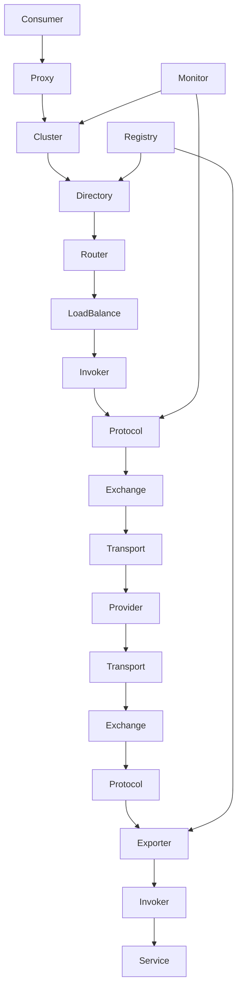

Apache Dubbo 是阿里巴巴开源的高性能 Java RPC 框架，广泛应用于构建分布式服务架构。Dubbo 提供了完整的 RPC 通信、服务治理、负载均衡、容错处理等功能，是构建微服务系统的理想选择。本章将深入探讨 Dubbo 的架构设计和核心模块，帮助读者理解其内部工作机制。

## Dubbo 架构概览

### 整体架构

Dubbo 采用分层架构设计，各层之间职责清晰、相互解耦。整体架构可以分为以下几层：

1. **Business Layer（业务层）**：实际的业务逻辑实现
2. **Service Layer（服务层）**：暴露和引用远程服务的接口层
3. **Configuration Layer（配置层）**：配置管理，包括应用配置、服务配置等
4. **Proxy Layer（代理层）**：服务代理，生成服务消费者和服务提供者的代理对象
5. **Registry Layer（注册层）**：服务注册与发现
6. **Cluster Layer（集群层）**：服务路由、负载均衡、容错处理
7. **Monitor Layer（监控层）**：监控服务调用统计
8. **Protocol Layer（协议层）**：RPC 协议实现
9. **Exchange Layer（信息交换层）**：封装请求响应模式
10. **Transport Layer（网络传输层）**：网络传输实现
11. **Serialize Layer（序列化层）**：数据序列化

### 核心组件交互流程



## 核心模块详解

### 1. Proxy 层（代理层）

Proxy 层负责生成服务消费者和服务提供者的代理对象，屏蔽了远程调用的复杂性。

```java
// 服务接口定义
public interface UserService {
    User getUserById(Long id);
    List<User> getUsers(List<Long> ids);
}

// 服务提供者实现
public class UserServiceImpl implements UserService {
    @Override
    public User getUserById(Long id) {
        // 实际业务逻辑
        return new User(id, "User" + id);
    }
    
    @Override
    public List<User> getUsers(List<Long> ids) {
        // 实际业务逻辑
        return ids.stream().map(id -> new User(id, "User" + id)).collect(Collectors.toList());
    }
}

// 服务消费者使用
public class ConsumerApplication {
    public static void main(String[] args) {
        // 通过 Spring 配置或 API 方式获取远程服务代理
        UserService userService = (UserService) ReferenceConfig.getReference(UserService.class);
        
        // 像调用本地方法一样调用远程服务
        User user = userService.getUserById(1L);
        System.out.println("User: " + user);
    }
}
```

代理层的核心实现：

```java
// 简化的代理工厂实现
public class JavassistProxyFactory implements ProxyFactory {
    @Override
    @SuppressWarnings("unchecked")
    public <T> T getProxy(Invoker<T> invoker, Class<?>[] interfaces) {
        return (T) Proxy.getProxy(interfaces).newInstance(new InvokerInvocationHandler(invoker));
    }
    
    @Override
    public <T> Invoker<T> getInvoker(T proxy, Class<T> type, URL url) {
        return new AbstractProxyInvoker<T>(proxy, type, url) {
            @Override
            protected Object doInvoke(T proxy, String methodName, 
                                    Class<?>[] parameterTypes, Object[] arguments) throws Throwable {
                // 通过反射调用实际方法
                Method method = proxy.getClass().getMethod(methodName, parameterTypes);
                return method.invoke(proxy, arguments);
            }
        };
    }
}

// 调用处理器
public class InvokerInvocationHandler implements InvocationHandler {
    private final Invoker<?> invoker;
    
    public InvokerInvocationHandler(Invoker<?> invoker) {
        this.invoker = invoker;
    }
    
    @Override
    public Object invoke(Object proxy, Method method, Object[] args) throws Throwable {
        // 特殊方法直接处理
        if (method.getDeclaringClass() == Object.class) {
            return method.invoke(invoker, args);
        }
        
        // 包装成 RPC 调用
        String methodName = method.getName();
        Class<?>[] parameterTypes = method.getParameterTypes();
        if (parameterTypes.length == 0) {
            if ("toString".equals(methodName)) {
                return invoker.toString();
            } else if ("hashCode".equals(methodName)) {
                return invoker.hashCode();
            }
        } else if (parameterTypes.length == 1 && "equals".equals(methodName)) {
            return invoker.equals(args[0]);
        }
        
        // 构造 RPC 调用
        RpcInvocation invocation = new RpcInvocation(method, args);
        invocation.setAttachment(Constants.PATH_KEY, invoker.getUrl().getPath());
        invocation.setAttachment(Constants.VERSION_KEY, invoker.getUrl().getParameter(Constants.VERSION_KEY));
        
        // 执行调用
        Result result = invoker.invoke(invocation);
        
        // 处理结果
        if (result.hasException()) {
            throw result.getException();
        } else {
            return result.getValue();
        }
    }
}
```

### 2. Registry 层（注册层）

Registry 层负责服务的注册与发现，是 Dubbo 服务治理的核心组件。

```java
// 注册中心接口
public interface RegistryService {
    void register(URL url);
    void unregister(URL url);
    void subscribe(URL url, NotifyListener listener);
    void unsubscribe(URL url, NotifyListener listener);
    List<URL> lookup(URL url);
}

// 注册中心工厂
public interface RegistryFactory {
    @Adaptive({"protocol"})
    Registry getRegistry(URL url);
}

// ZooKeeper 注册中心实现
public class ZookeeperRegistry extends FailbackRegistry {
    private final ZookeeperClient zkClient;
    private final String root;
    
    public ZookeeperRegistry(URL url, ZookeeperTransporter zookeeperTransporter) {
        super(url);
        if (url.isAnyHost()) {
            throw new IllegalStateException("registry address == null");
        }
        
        String group = url.getParameter(Constants.GROUP_KEY, DEFAULT_ROOT);
        if (!group.startsWith(Constants.PATH_SEPARATOR)) {
            group = Constants.PATH_SEPARATOR + group;
        }
        this.root = group;
        zkClient = zookeeperTransporter.connect(url);
    }
    
    @Override
    public void doRegister(URL url) {
        try {
            zkClient.create(toUrlPath(url), url.getParameter(Constants.DYNAMIC_KEY, true));
        } catch (Throwable e) {
            throw new RpcException("Failed to register " + url + " to zookeeper " + getUrl() 
                                 + ", cause: " + e.getMessage(), e);
        }
    }
    
    @Override
    public void doUnregister(URL url) {
        try {
            zkClient.delete(toUrlPath(url));
        } catch (Throwable e) {
            throw new RpcException("Failed to unregister " + url + " to zookeeper " + getUrl() 
                                 + ", cause: " + e.getMessage(), e);
        }
    }
    
    @Override
    public void doSubscribe(final URL url, final NotifyListener listener) {
        try {
            if (Constants.ANY_VALUE.equals(url.getServiceInterface())) {
                // 订阅所有服务
                String root = toRootPath();
                ConcurrentMap<NotifyListener, ChildListener> listeners = zkListeners.get(url);
                if (listeners == null) {
                    zkListeners.putIfAbsent(url, new ConcurrentHashMap<NotifyListener, ChildListener>());
                    listeners = zkListeners.get(url);
                }
                ChildListener zkListener = listeners.get(listener);
                if (zkListener == null) {
                    listeners.putIfAbsent(listener, new ChildListener() {
                        @Override
                        public void childChanged(String path, List<String> children) {
                            if (children != null) {
                                urls.addAll(toUrlsWithEmpty(url, path, children));
                            }
                        }
                    });
                    zkListener = listeners.get(listener);
                }
                zkClient.addChildListener(root, zkListener);
            } else {
                // 订阅特定服务
                List<URL> urls = new ArrayList<URL>();
                for (String path : toCategoriesPath(url)) {
                    ConcurrentMap<NotifyListener, ChildListener> listeners = zkListeners.get(url);
                    if (listeners == null) {
                        zkListeners.putIfAbsent(url, new ConcurrentHashMap<NotifyListener, ChildListener>());
                        listeners = zkListeners.get(url);
                    }
                    ChildListener zkListener = listeners.get(listener);
                    if (zkListener == null) {
                        listeners.putIfAbsent(listener, new ChildListener() {
                            @Override
                            public void childChanged(String path, List<String> children) {
                                // 处理子节点变化
                                handleChildChanged(path, children, url, listener);
                            }
                        });
                        zkListener = listeners.get(listener);
                    }
                    zkClient.addChildListener(path, zkListener);
                    // 获取当前子节点
                    List<String> children = zkClient.getChildren(path);
                    if (children != null) {
                        urls.addAll(toUrlsWithEmpty(url, path, children));
                    }
                }
                notify(url, listener, urls);
            }
        } catch (Throwable e) {
            throw new RpcException("Failed to subscribe " + url + " to zookeeper " + getUrl() 
                                 + ", cause: " + e.getMessage(), e);
        }
    }
    
    private void handleChildChanged(String path, List<String> children, URL url, NotifyListener listener) {
        // 处理子节点变化的具体逻辑
    }
}
```

### 3. Protocol 层（协议层）

Protocol 层负责 RPC 协议的实现，包括服务暴露和服务引用。

```java
// 协议接口
public interface Protocol {
    int getDefaultPort();
    
    @Adaptive
    <T> Exporter<T> export(Invoker<T> invoker) throws RpcException;
    
    @Adaptive
    <T> Invoker<T> refer(Class<T> type, URL url) throws RpcException;
    
    void destroy();
}

// Dubbo 协议实现
public class DubboProtocol extends AbstractProtocol {
    public static final String NAME = "dubbo";
    public static final int DEFAULT_PORT = 20880;
    
    private final Map<String, ExchangeServer> serverMap = new ConcurrentHashMap<String, ExchangeServer>();
    private final Map<String, ReferenceCountExchangeClient> referenceClientMap = 
        new ConcurrentHashMap<String, ReferenceCountExchangeClient>();
    
    @Override
    public <T> Exporter<T> export(Invoker<T> invoker) throws RpcException {
        URL url = invoker.getUrl();
        
        // 创建服务键
        String key = serviceKey(url);
        DubboExporter<T> exporter = new DubboExporter<T>(invoker, key, exporterMap);
        exporterMap.put(key, exporter);
        
        // 启动服务器
        openServer(url);
        
        return exporter;
    }
    
    @Override
    public <T> Invoker<T> refer(Class<T> serviceType, URL url) throws RpcException {
        // 创建远程调用 Invoker
        DubboInvoker<T> invoker = new DubboInvoker<T>(serviceType, url, getClients(url), invokers);
        invokers.add(invoker);
        return invoker;
    }
    
    private void openServer(URL url) {
        // 查找服务器，如果不存在则创建
        String key = url.getAddress();
        ExchangeServer server = serverMap.get(key);
        if (server == null) {
            serverMap.put(key, createServer(url));
        } else {
            // 服务器已存在，重置可接受连接数
            server.reset(url);
        }
    }
    
    private ExchangeServer createServer(URL url) {
        // 发送心跳包
        url = url.addParameterIfAbsent(Constants.HEARTBEAT_KEY, String.valueOf(Constants.DEFAULT_HEARTBEAT));
        
        // 绑定服务器
        return Exchangers.bind(url, requestHandler);
    }
    
    private ExchangeClient[] getClients(URL url) {
        // 是否共享连接
        boolean service_share_connect = false;
        int connections = url.getParameter(Constants.CONNECTIONS_KEY, 0);
        // 如果没有配置连接数，则共享连接
        if (connections == 0) {
            service_share_connect = true;
            connections = 1;
        }
        
        ExchangeClient[] clients = new ExchangeClient[connections];
        for (int i = 0; i < clients.length; i++) {
            if (service_share_connect) {
                clients[i] = getSharedClient(url);
            } else {
                clients[i] = initClient(url);
            }
        }
        return clients;
    }
    
    private ExchangeClient getSharedClient(URL url) {
        String key = url.getAddress();
        ReferenceCountExchangeClient client = referenceClientMap.get(key);
        if (client != null) {
            if (!client.isClosed()) {
                client.incrementAndGetCount();
                return client;
            } else {
                referenceClientMap.remove(key);
            }
        }
        
        ExchangeClient exchagneclient = initClient(url);
        client = new ReferenceCountExchangeClient(exchagneclient, ghostClientMap);
        referenceClientMap.put(key, client);
        ghostClientMap.remove(key);
        return client;
    }
    
    private ExchangeClient initClient(URL url) {
        // 客户端类型设置
        String str = url.getParameter(Constants.CLIENT_KEY, url.getParameter(Constants.SERVER_KEY, Constants.DEFAULT_REMOTING_CLIENT));
        
        url = url.addParameter(Constants.CODEC_KEY, DubboCodec.NAME);
        // 启用心跳
        url = url.addParameterIfAbsent(Constants.HEARTBEAT_KEY, String.valueOf(Constants.DEFAULT_HEARTBEAT));
        
        // 连接应该由哪个线程池处理
        ExchangeClient client;
        try {
            client = Exchangers.connect(url);
        } catch (RemotingException e) {
            throw new RpcException("Failed to connect to server " + url + ", cause: " + e.getMessage(), e);
        }
        
        return client;
    }
}
```

### 4. Cluster 层（集群层）

Cluster 层负责集群容错，包括负载均衡、容错处理等。

```java
// 集群接口
public interface Cluster {
    @Adaptive
    <T> Invoker<T> join(Directory<T> directory) throws RpcException;
}

// 失败转移集群实现
public class FailoverCluster implements Cluster {
    public final static String NAME = "failover";
    
    @Override
    public <T> Invoker<T> join(Directory<T> directory) throws RpcException {
        return new FailoverClusterInvoker<T>(directory);
    }
}

// 失败转移集群 Invoker
public class FailoverClusterInvoker<T> extends AbstractClusterInvoker<T> {
    public FailoverClusterInvoker(Directory<T> directory) {
        super(directory);
    }
    
    @Override
    @SuppressWarnings({"unchecked", "rawtypes"})
    public Result doInvoke(Invocation invocation, final List<Invoker<T>> invokers, LoadBalance loadbalance) throws RpcException {
        List<Invoker<T>> copyinvokers = invokers;
        checkInvokers(copyinvokers, invocation);
        int len = getUrl().getMethodParameter(invocation.getMethodName(), Constants.RETRIES_KEY, Constants.DEFAULT_RETRIES) + 1;
        if (len <= 0) {
            len = 1;
        }
        
        // 重试循环
        RpcException le = null; // 最后的异常
        List<Invoker<T>> invoked = new ArrayList<Invoker<T>>(copyinvokers.size()); // 已调用的 Invoker
        Set<String> providers = new HashSet<String>(len);
        for (int i = 0; i < len; i++) {
            // 重新列出 Invoker，避免在重试时使用已失败的 Invoker
            if (i > 0) {
                checkWhetherDestroyed();
                copyinvokers = list(invocation);
                // 检查是否有可用的 Invoker
                checkInvokers(copyinvokers, invocation);
            }
            
            // 负载均衡选择 Invoker
            Invoker<T> invoker = select(loadbalance, invocation, copyinvokers, invoked);
            invoked.add(invoker);
            RpcContext.getContext().setInvokers((List) invoked);
            try {
                // 执行调用
                Result result = invoker.invoke(invocation);
                if (le != null && logger.isWarnEnabled()) {
                    logger.warn("Although retry the method " + invocation.getMethodName()
                            + " in the service " + getInterface().getName()
                            + " was successful by the provider " + invoker.getUrl().getAddress()
                            + ", but there have been failed providers " + providers
                            + " (" + providers.size() + "/" + copyinvokers.size()
                            + ") from the registry " + directory.getUrl().getAddress()
                            + " on the consumer " + NetUtils.getLocalHost()
                            + " using the dubbo version " + Version.getVersion() + ". Last error is: "
                            + le.getMessage(), le);
                }
                return result;
            } catch (RpcException e) {
                if (e.isBiz()) { // biz exception.
                    throw e;
                }
                le = e;
            } catch (Throwable e) {
                le = new RpcException(e.getMessage(), e);
            } finally {
                providers.add(invoker.getUrl().getAddress());
            }
        }
        
        throw new RpcException(le != null ? le.getCode() : 0, "Failed to invoke the method "
                + invocation.getMethodName() + " in the service " + getInterface().getName()
                + ". Tried " + len + " times of the providers " + providers
                + " (" + providers.size() + "/" + copyinvokers.size()
                + ") from the registry " + directory.getUrl().getAddress()
                + " on the consumer " + NetUtils.getLocalHost() + " using the dubbo version "
                + Version.getVersion() + ". Last error is: "
                + (le != null ? le.getMessage() : ""), le != null && le.getCause() != null ? le.getCause() : le);
    }
}
```

## Dubbo SPI 机制

Dubbo 使用了自研的 SPI（Service Provider Interface）机制来实现扩展点加载。

```java
// 扩展加载器
public class ExtensionLoader<T> {
    private static final ConcurrentMap<Class<?>, ExtensionLoader<?>> EXTENSION_LOADERS = 
        new ConcurrentHashMap<Class<?>, ExtensionLoader<?>>();
    
    private static final ConcurrentMap<Class<?>, Object> EXTENSION_INSTANCES = 
        new ConcurrentHashMap<Class<?>, Object>();
    
    private final Class<?> type;
    private final ExtensionFactory objectFactory;
    
    private final ConcurrentMap<String, Holder<Object>> cachedInstances = 
        new ConcurrentHashMap<String, Holder<Object>>();
    
    private final Holder<Map<String, Class<?>>> cachedClasses = new Holder<Map<String, Class<?>>>();
    
    public static <T> ExtensionLoader<T> getExtensionLoader(Class<T> type) {
        if (type == null)
            throw new IllegalArgumentException("Extension type == null");
        if (!type.isInterface()) {
            throw new IllegalArgumentException("Extension type(" + type + ") is not interface!");
        }
        if (!withExtensionAnnotation(type)) {
            throw new IllegalArgumentException("Extension type(" + type + 
                    ") is not extension, because WITHOUT @" + SPI.class.getSimpleName() + " Annotation!");
        }
        
        ExtensionLoader<T> loader = (ExtensionLoader<T>) EXTENSION_LOADERS.get(type);
        if (loader == null) {
            EXTENSION_LOADERS.putIfAbsent(type, new ExtensionLoader<T>(type));
            loader = (ExtensionLoader<T>) EXTENSION_LOADERS.get(type);
        }
        return loader;
    }
    
    public T getExtension(String name) {
        if (name == null || name.length() == 0)
            throw new IllegalArgumentException("Extension name == null");
        if ("true".equals(name)) {
            return getDefaultExtension();
        }
        Holder<Object> holder = cachedInstances.get(name);
        if (holder == null) {
            cachedInstances.putIfAbsent(name, new Holder<Object>());
            holder = cachedInstances.get(name);
        }
        Object instance = holder.get();
        if (instance == null) {
            synchronized (holder) {
                instance = holder.get();
                if (instance == null) {
                    instance = createExtension(name);
                    holder.set(instance);
                }
            }
        }
        return (T) instance;
    }
    
    private T createExtension(String name) {
        Class<?> clazz = getExtensionClasses().get(name);
        if (clazz == null) {
            throw findException(name);
        }
        try {
            T instance = (T) EXTENSION_INSTANCES.get(clazz);
            if (instance == null) {
                EXTENSION_INSTANCES.putIfAbsent(clazz, clazz.newInstance());
                instance = (T) EXTENSION_INSTANCES.get(clazz);
            }
            injectExtension(instance);
            Set<Class<?>> wrapperClasses = getExtensionWrapperClasses();
            if (wrapperClasses != null && !wrapperClasses.isEmpty()) {
                for (Class<?> wrapperClass : wrapperClasses) {
                    instance = injectExtension((T) wrapperClass.getConstructor(type).newInstance(instance));
                }
            }
            return instance;
        } catch (Throwable t) {
            throw new IllegalStateException("Extension instance(name: " + name + ", class: " +
                    type + ")  could not be instantiated: " + t.getMessage(), t);
        }
    }
}
```

## 总结

Dubbo 的架构设计体现了高度的模块化和可扩展性。通过分层设计，各层职责明确，相互解耦，使得系统易于维护和扩展。核心模块包括代理层、注册层、协议层和集群层，每个模块都有其特定的职责和实现方式。

关键要点：

1. **分层架构**：清晰的分层设计使得各层职责明确，便于维护和扩展
2. **SPI 机制**：通过自研的 SPI 机制实现灵活的扩展点加载
3. **代理机制**：通过动态代理屏蔽远程调用的复杂性
4. **注册中心**：支持多种注册中心实现，提供服务注册与发现功能
5. **集群容错**：提供多种集群容错策略，保证服务的高可用性

在下一章中，我们将深入探讨 Dubbo 的协议、注册中心和 SPI 机制的具体实现，进一步理解 Dubbo 的设计理念和实现细节。